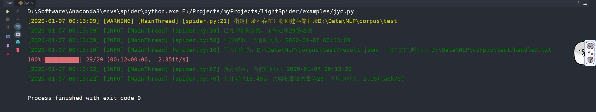
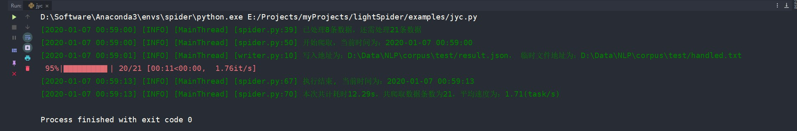

# lightSpider
lightsmile个人的用于爬取网络公开语料数据的mini通用爬虫框架。

## 声明

1. 本项目仅是本人简单尝试，系统功能并不完善。
2. 已有的特性：
   - 启用代理池，降低ip被封带来的损失风险
   - 启用多进程，加快进程爬取速度
   - 实现断点重爬，即使程序因内外在原因挂掉了，可以继续执行任务脚本继续爬取
   - 启用进度条，可实时显示当前爬取总进度与爬取速度，用户体验较好
3. 本项目并没有：
   - 验证码登录功能
   - 各种自定义功能
   - 等等。

## 安装

```bash
pip install lightSpider
```
建议使用国内源来安装，如使用以下命令：

```bash
pip install -i https://pypi.douban.com/simple/ lightSpider
```

## 使用流程

### step1：启动代理池服务

详情参见[Python3WebSpider/ProxyPool: Proxy Pool](https://github.com/Python3WebSpider/ProxyPool)

### step2: 引入必要依赖库

```python
from lightspider.spider import Spider
from lightspider.worker import light
```
### step3：编写页面解析函数

如：
```python
# 编写页面解析函数
@light
def handler(html):
    html = etree.HTML(html)
    info = html.xpath('//div[@class="col-md-8"]')[0]
    words = [re.sub(r'\(\d+\)', '', item.xpath('string(.)')) for item in info.xpath('./b')[:-1]]
    mean = info.xpath('./a/text()')[0]
    return {
        'mean': mean,
        'words': words
    }, None
```

### step4：编写得到tasks脚本

如：
```python
tasks = []
for i in range(1, 30):
    tasks.append(i)
```

### step5: 创建`Spider`对象

如：
```python
base_url = 'https://www.cilin.org/jyc/b_{}.html'
spider = Spider(base_url=base_url, style='json', save_path=r'D:\Data\NLP\corpus\test')
```

### step6: 执行`Spider`对象的`run`方法

如：
```python
if __name__ == '__main__':
    spider.run(tasks, handler)
```

## [完整示例](https://github.com/smilelight/lightSpider/blob/master/examples/jyc.py)

```python
from lightspider.spider import Spider
from lightspider.worker import light

from lxml import etree
import re

# 编写页面解析函数
@light
def handler(html):
    html = etree.HTML(html)
    info = html.xpath('//div[@class="col-md-8"]')[0]
    words = [re.sub(r'\(\d+\)', '', item.xpath('string(.)')) for item in info.xpath('./b')[:-1]]
    mean = info.xpath('./a/text()')[0]
    return {
        'mean': mean,
        'words': words
    }, None


tasks = []
for i in range(1, 30):
    tasks.append(i)

base_url = 'https://www.cilin.org/jyc/b_{}.html'
spider = Spider(base_url=base_url, style='json', save_path=r'D:\Data\NLP\corpus\test')


if __name__ == '__main__':
    spider.run(tasks, handler)

```

## 执行结果

如图：


断点重爬效果如图：



## 参考
1. [Python3WebSpider/ProxyPool: Proxy Pool](https://github.com/Python3WebSpider/ProxyPool)
2. [如何在python中通过多进程使用tqdm？ - VoidCC](http://cn.voidcc.com/question/p-dtnumnri-bhw.html)
3. [编写多进程爬虫 - 知乎](https://zhuanlan.zhihu.com/p/76866650)